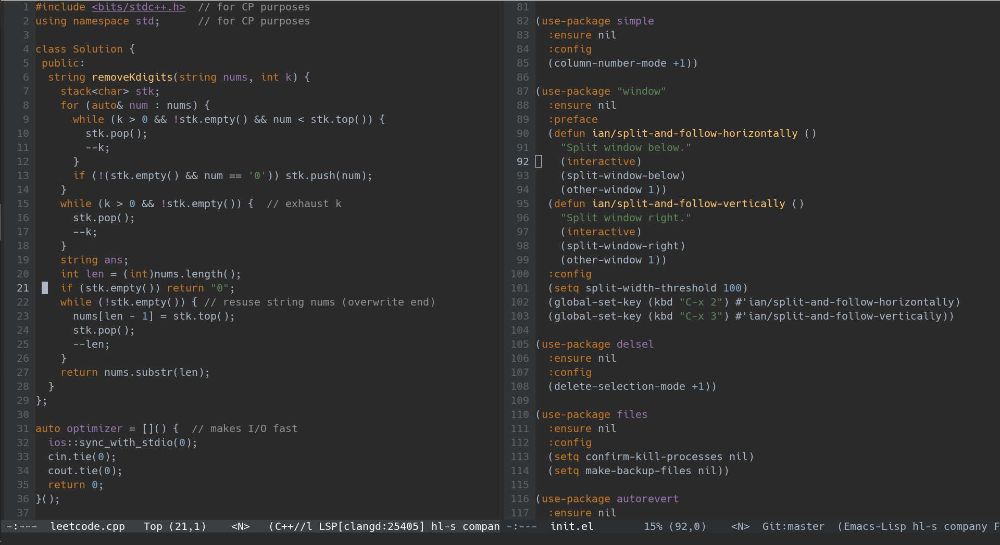

<h3 align="center">JetBrains Darcula (Default Dark) for Emacs</h3>
<hr/>


<p align="center">

</p>

<p align="center">
<a href="https://github.com/ianpan870102/wilmersdorf-emacs-theme"></a>
<a href="https://www.gnu.org/licenses/gpl-3.0"></a>
</p>

<br/>

<p align="center">A complete port of the default JetBrains Darcula theme for Emacs</p>

<br/>



<br/>

#### Installation: use-package

```emacs-lisp
(use-package jetbrains-darcula-theme
  :config
  (load-theme 'jetbrains-darcula t))
```


#### Installation: manual install

Download `jetbrains-darcula-theme.el` and put it under `~/.emacs.d/themes/` (or `~/.config/emacs/themes/`), then add these lines to your `init.el`:

```emacs-lisp
(add-to-list 'custom-theme-load-path "~/.emacs.d/themes/")
; or
(add-to-list 'custom-theme-load-path "~/.config/emacs/themes/")

(load-theme 'jetbrains-darcula t)
```

#### Installation: straight

Requires [use-package](https://github.com/jwiegley/use-package) and [straight.el](https://github.com/raxod502/straight.el)
Add these lines to your 'init.el':

```emacs-lisp
(use-package jetbrains-darcula-theme
  :straight (:host github :repo "ianpan870102/jetbrains-darcula-emacs-theme")
  :custom
  (load-theme 'jetbrains-darcula t))
```

#### User-customization

You need `after-load-theme-hook`, if you don't already have it, define one like this:

```emacs-lisp
(defvar after-load-theme-hook nil
  "Hook run after a color theme is loaded using `load-theme'.")

(defun run-after-load-theme-hook (&rest _)
  "Run `after-load-theme-hook'."
  (run-hooks 'after-load-theme-hook))

(advice-add #'load-theme :after #'run-after-load-theme-hook)
```

Then in your `use-package` declaration:

```emacs-lisp
(use-package jetbrains-darcula-theme
  :straight (:host github :repo "ianpan870102/jetbrains-darcula-emacs-theme")
  :config
  (defun customize-jetbrains-darcula ()
    "Customize jetbrains darcula theme"
    (if (member 'jetbrains-darcula custom-enabled-themes)
        (jetbrains-darcula-with-color-variables
         (custom-theme-set-faces
          'jetbrains-darcula
          `(default ((t (:foreground ,fg1 :background ,bg0))))))))
  (add-hook 'after-load-theme-hook 'customize-jetbrains-darcula)
  (load-theme 'jetbrains-darcula t))
```


Copyright© 2020 Ian Y.E. Pan

This program is free software: you can redistribute it and/or modify it under the terms of the GNU General Public License as published by the Free Software Foundation, either version 3 of the License, or (at your option) any later version.

This program is distributed in the hope that it will be useful, but WITHOUT ANY WARRANTY; without even the implied warranty of MERCHANTABILITY or FITNESS FOR A PARTICULAR PURPOSE. See the GNU General Public License for more details.

You should have received a copy of the GNU General Public License along with this program. If not, see https://www.gnu.org/licenses/.
